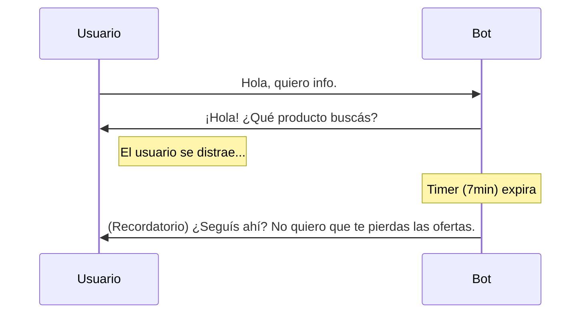

# ⏳ Flujos de Seguimiento (Idle)

Una de las características premium de este bot es su capacidad de **reenganche** o "Seguimiento Automático". Si un usuario deja de responder, el bot intentará retomar la conversación.

## ⚙️ ¿Cómo funciona?

El sistema utiliza timers configurables para disparar mensajes automáticos si no se detecta actividad del usuario en Shards de tiempo específicos.

### Estados de Seguimiento

| Nivel | Tiempo (Minutos) | Variable Env | Propósito |
| :--- | :--- | :--- | :--- |
| **Recordatorio 1** | 7 min | `timeOutCierre` | Notifica que el bot sigue esperando. |
| **Recordatorio 2** | 45 min | `timeOutSeguimiento2` | Reintento amable ofreciendo ayuda. |
| **Cierre Final** | 120 min | `timeOutSeguimiento3` | Mensaje de despedida y cierre de sesión. |

## 🛠 Lógica Técnica (`idleFlow.ts`)

El bot monitorea cada mensaje entrante. Al recibir un mensaje:
1. Se limpia cualquier timer de seguimiento previo para ese usuario (`clearTimeout`).
2. Se inicia un nuevo contador basado en el tiempo de la variable `timeOutCierre`.
3. Si el contador llega a cero sin nuevos mensajes, se activa el `idleFlow`, que envía el mensaje configurado en `msjSeguimiento1`.

### Ejemplo de flujo

---
> **Nota**: Este comportamiento se puede desactivar globalmente o ajustar individualmente desde el archivo de [Variables de Entorno](../configuracion/variables.md).
